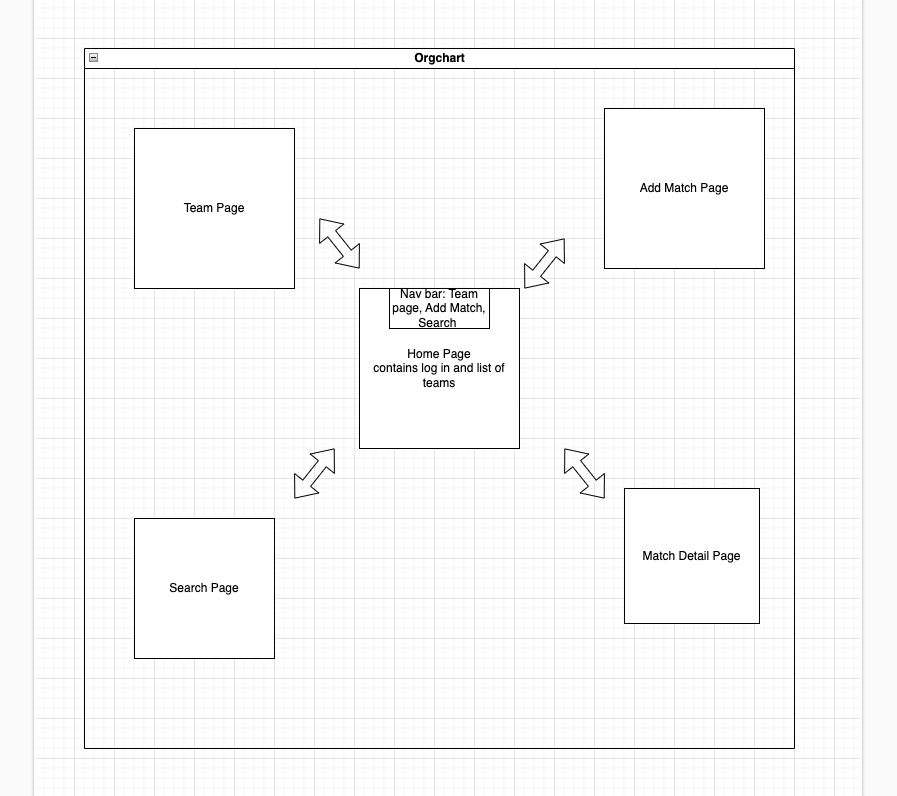

# Football Team Tracker

## Date: 05/26/2023

### By: Patton Grooms

#### [GitHub](https://github.com/pattongrooms) | [LinkedIn](https://www.linkedin.com/in/patton-grooms/)

---

### Description

#### This is a football match tracker that is user friendly. The user will have access to a football team database they can use to edit match locations, dates, scores, etc.

---

### **_Technologies Used_**

- Github
- Trello
- MongoDB
- OAuth
- HTML
- CSS
- Javascript

### **_Getting Started_**

##### A Trello board was used to keep track of development progress and can be viewed [here](https://trello.com/b/l9M0eZN8/football-team-tracker).

##### The project itself was deployed and can be viewed [here]().

---

### **_Screenshots_**

##### Football Match Tracker Wireframe

---

### **_Credits_**

##### Background Images: [Teams]

---
